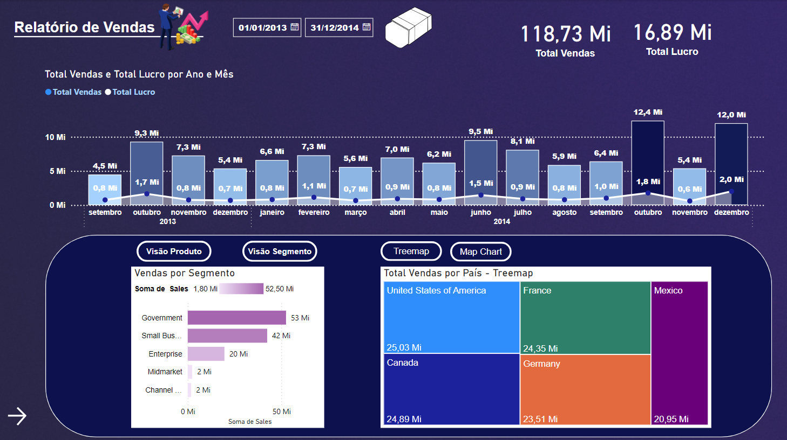
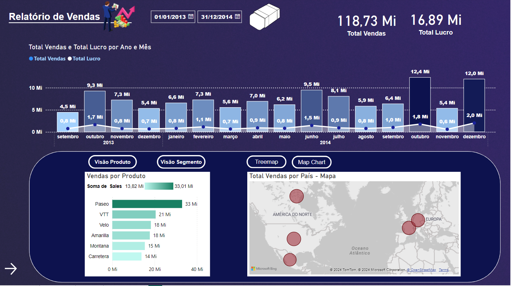
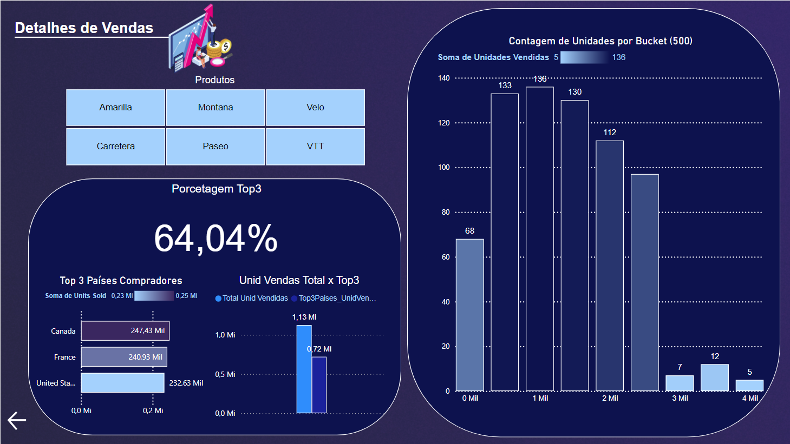

# Projeto Dashboard -  Relatório Financeiro :bar_chart:

## NTT DATA - Engenharia de Dados com Python

  

Este relatório de vendas em Power BI foi desenvolvido com base em uma modelagem de dados em _Star Schema_, estruturada a partir de uma planilha de dados. Esse modelo foi escolhido para otimizar a eficiência e o desempenho do relatório, facilitando a análise e navegação.

  

### Projeto do Módulo 5 de Power BI -  Relatório Financeiro.

### Home Page

### Relatório Vendas

**Cartões:** Exibem as somas totais de _Sales_ e _Profit_, destacando as métricas principais para fácil visualização.

**Segmentação de Data:** Permite filtrar períodos específicos, dando flexibilidade na análise de tempo.

**Gráfico de Coluna e Linha**
-   **Objetivo:** Facilitar a análise das vendas ao longo do tempo, permitindo identificar tendências sazonais, picos e quedas nas vendas e lucratividade.
#### Gráfico de Barras - Sales por Segmento/Produto

-   **Objetivo:** Ajudar a identificar quais segmentos e produtos são os mais significativos em termos de vendas, permitindo a comparação rápida entre diferentes categorias.
- **Detalhe Adicional:** Botões para alternar entre as perspectivas de _Sales por Segmento_ e _Sales por Produto_, facilitando uma visão adaptável de acordo com o interesse do usuário.

#### Gráfico de Vendas por País – Segmentação de Visualização Mapa e Treemap

-   **Objetivo:** Fornecer uma visualização geográfica das vendas, permitindo identificar rapidamente onde estão localizados os principais mercados.
-   **Descrição:** Utiliza um mapa e um treemap para exibir a distribuição das vendas por país, possibilitando uma análise comparativa das regiões que contribuem mais para o volume total de vendas.

**Segmentação - Segmento e Treemap**

**Segmentação - Produto e Mapa**

### Relatório de Detalhes de Vendas
**Segmentação de Produto:** Filtro que permite isolar produtos, útil para entender o desempenho individual.

**Histograma de Unidades Vendidas**

-   **Objetivo:** Visualizar a distribuição de unidades vendidas em intervalos definidos, revelando padrões de vendas e frequências que indicam a popularidade dos produtos.

**Top 3 Países Compradores**

- **Gráfico de Barras:** Destacar os principais mercados geográficos para o negócio, mostrando os três países que mais compram, o que pode direcionar estratégias de expansão e alocação de recursos.
-   **Cartão:** Exibe a porcentagem das unidades vendidas pelos três principais países em relação ao total, enfatizando a relevância dessas regiões para o sucesso geral das vendas.
- **Gráfico de Colunas:** Comparar o total de unidades vendidas com as vendas dos três principais países compradores, permitindo uma análise clara da contribuição desses países para o volume total de vendas.

**Destalhes de Vendas**

